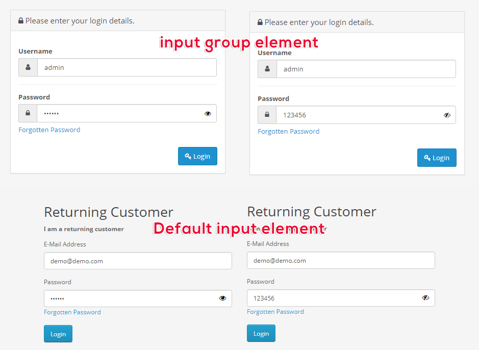

# TronLink Wallet Address
**TRX - BTC - BTT - USDT**: TH9RyofE7WiDDVVFLMJgFns2ByBRmgQzNB

# jQuery Show Hide Password

- Add show hide password icon in form input element.
- Bootstrap default input and input-group element supports.
- The icon appears when you start enter the password.
- Min js file size: 1.13KB

[DEMO PAGE](https://3x.opencart-templates.net/index.php?route=account/login) | [OPENCART EXTENSION](https://openix.io/en/opencart-show-hide-password)



# Requirements

- jQuery v1.7.x and newer
- Bootstrap v3.x and newer
- Font Awesome v4.x and newer

# Usage

Include the show-hide-password.js file in your project.

```javascript
$(document).ready(function() {
  $('input[type=\'password\']').showHidePassword();
});
```

# Options

Some settings will be added in future releases

Option | Description
---|---
option | option text

